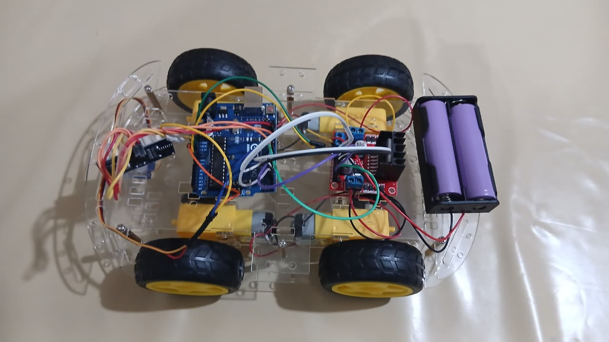
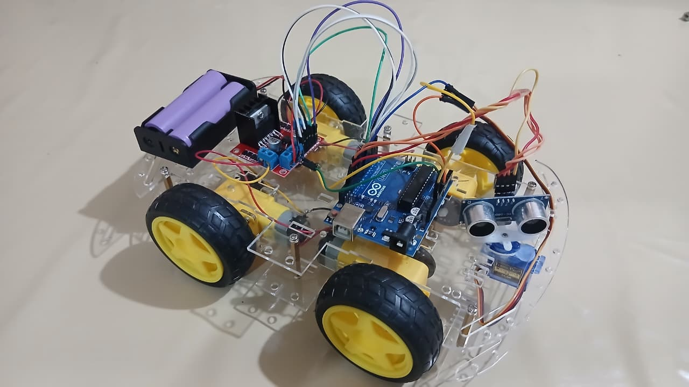

# Project Photos

## Robot Assembly

### Top View - Complete Setup
Shows Arduino, L298N motor driver, servo motor with sensor, and battery connections.

### Angled View - Side Perspective
Clear view of motor connections, wiring, and component placement.

### Front View - Motor Detail
Shows the 4 motors clearly, chassis structure, and soldered motor connections.

## Component Details

- **Arduino Uno** - Main microcontroller (blue board, center)
- **L298N Motor Driver** - Red board for motor control
- **HC-SR04 Sensor** - White sensor module (front)
- **Continuous Rotation Servo** - Controls sensor rotation
- **4 DC Motors** - Yellow wheels with black tires
- **Battery Pack** - Purple 7.4V Li-ion batteries
- **Soldered Connections** - Motors paired and connected to L298N
